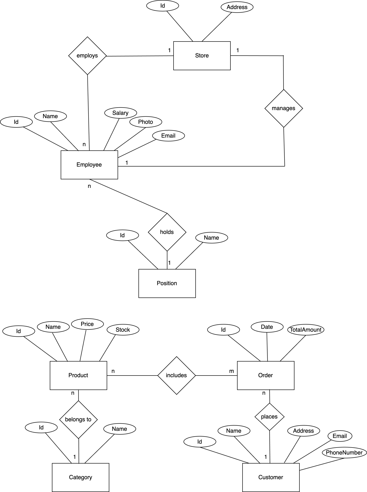

## Documentation

## Database

Here's an overview of the key entities and relationships within our database:

- A **store** usually has many **employees**, and **each employee** is assigned to a **single store**.
- A **position** defines a job role (e.g, "Manager", "Cashier"). Each **employee** holds one **position**, and roles are shared across **employees**.
- Each **store** may have a **manager** (**an employee** with a specific postion).
- A **customer** is a user that can place **multiple orders**, and logically, **each order** belongs to a **single customer** (there's no shared orders).
- An **order** may contain **many products** in different quantities, managed through a `ProductOrders` table. A **product** can be found in **different orders**.
- Each **product** may belong to a **product category**.

> Note: Here we suppose that Stores are just our physical stores (that we show up in our website and we handle from our CMS). From our admin panel we **don't handle** the **stock per-store**, but we can see the total quantity of a product we have though.

**Entity-Relationship diagram**

    

 

**Tables visualization**

    

 
